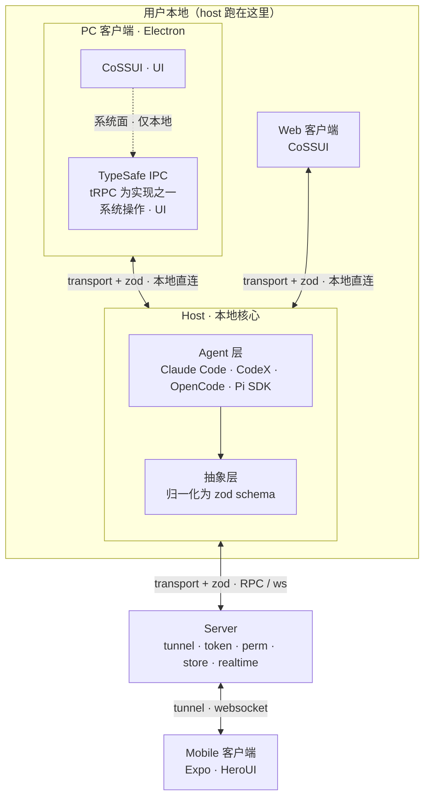

# Link Code — 项目技术文档(Claude Code 上下文)

> **如何使用本文档**
> 这是给 Claude Code 的项目上下文。建议放在仓库根目录作为 `CLAUDE.md`,或从 `CLAUDE.md` 中引用本文件。
>
> 全文用三类标记区分确定程度,**请严格遵守**:
> - ✅ **已确定**:团队定下的事实,视为约束。
> - 🔧 **提议 / 默认**:本文档给出的合理默认(目录、接口、选型等)。可遵循;若与仓库现有代码冲突,以现有代码为准。
> - ❓ **待确认**:尚未决定。**不要凭空发明或擅自决定,先停下来向我确认。**
>
> 当你不确定某个 ❓ 项时,宁可问,不要猜。

---

## 1. 项目是什么

✅ Link Code 是一个**面向通用 coding agent 的统一 GUI**:在用户本地跑一个 `host` 统一接管各家 coding agent,并把它们风格各异的消息归一化成同一套数据契约;用户可从 **PC / Web / Mobile** 三端连接同一个 host,获得一致界面。移动端可经中转 `Server` 在外网远程查看与控制本地的 host。

✅ 系统由四部分组成:**Client(PC)**、**Web**、**Mobile**、**Server**;贯穿核心是 **Host(本地引擎)**。

---

## 2. 核心原则(务必遵守)

1. ✅ **zod schema 是唯一数据契约**。所有跨进程、跨端、以及 host 抽象层之后的业务消息,其类型都来自 `packages/schema` 的 zod 定义。流程永远是「先改 schema,再改实现」;在所有信任边界(网络、IPC、agent 输出)用 zod 做运行时校验。
2. ✅ **端到端 TypeScript 类型安全**。不要用 `any` 绕过契约;类型应能从 schema 推导(`z.infer`)。
3. ✅ **数据面与系统面严格分离**:
   - **数据面**:业务数据只走 `transport`(通信协议层)+ zod 消息。
   - **系统面**:Electron 的系统级操作 / UI 桥接只走 `TypeSafe IPC`。
   - 两者不得混用。**TypeSafe IPC 绝不承载任何业务数据。**
4. ✅ **本地优先**:host 跑在用户本机。PC / Web 在本地直连 host;Mobile 经 Server 的 tunnel(websocket)接入。
5. ✅ **面向接口、实现可替换**:
   - `TypeSafe IPC` 是一个接口,`tRPC` 只是默认实现之一,可替换。
   - 每接入一个新 agent = 实现一个统一的 adapter,不在上层散落各家 SDK 的判断。
6. ✅ **transport 与承载解耦**:本地(进程内 / IPC)与远程(ws)共用同一套 `transport` 抽象和同一套 zod 消息格式;上层不感知底层是本地还是隧道。

---

## 3. 系统架构



---

## 4. 模块与职责

### 4.1 Host(本地核心)
✅ 跑在用户本机,真正干活的引擎。内部分两层:Agent 适配层 + 抽象层。对客户端暴露数据面接口,对 Server 暴露 ws 接口。

### 4.2 Agent 适配层
✅ 接入各家 coding agent 的 SDK:Claude Code、CodeX、OpenCode、Pi SDK。每家一个 adapter,向上屏蔽差异。
❓ `CC` 是否确指 Claude Code(早期口述出现过 "Cloud Code");`Pi SDK` 具体是什么 SDK;以及四家 SDK 各自的接入形态(进程 / HTTP / 库调用),均待确认后再写具体 adapter。

### 4.3 抽象层 / zod schema
✅ 把各 adapter 的原生事件 / 消息归一化为项目自己的 zod schema,对外只暴露规范化格式。

### 4.4 transport
✅ 专门的通信协议层,负责"消息怎么传"。🔧 提议两个实现:`LocalTransport`(本机直连)与 `WsTransport`(经 Server 隧道)。
❓ transport 内部是否需要再分层(序列化、重连、心跳、鉴权)待确认。

### 4.5 TypeSafe IPC(仅 PC / Electron)
✅ 类型安全的 Electron IPC 抽象,处理 Electron 主进程↔渲染进程的系统级操作与 UI 桥接;**不碰业务数据**;仅 PC 端存在,Web / Mobile 没有这一层。`tRPC` 为默认实现,可替换。
❓ 除 tRPC 外的候选实现待补充。

### 4.6 客户端三端
✅ 三端共享同一套数据层逻辑,差异在"壳 / 运行环境"与"UI 组件库":

| 端 | 壳 / 运行环境 | UI 组件库 | 本地系统桥 |
|---|---|---|---|
| PC | Electron ✅ | CoSSUI(❓ 是否复用 Web) | TypeSafe IPC ✅(tRPC 默认) |
| Web | 浏览器 ✅ | CoSSUI ✅ | 无 ✅ |
| Mobile | Expo ✅ | HeroUI ✅ | 无 ✅ |

✅ 客户端数据请求 / 缓存用 SWR / React Query。✅ UI 设计参考 CodeX(设计灵感;落地组件库为 CoSSUI / HeroUI)。

### 4.7 Server(中转 / 隧道)
✅ 本身不跑 agent。职责:`tunnel`(让外网设备连到本地 host)、`token`(鉴权)、`perm`(权限)、`store`(存储)、`realtime`(实时)。Host ↔ Server 走 RPC over websocket。
❓ `store` / `realtime` / `perm` 的具体数据模型与交互待确认。

---

## 5. 仓库结构(🔧 提议)

> 这是面向"多端共享同一份 zod 契约"的典型 monorepo 布局。**结构与工具均为提议,落地前请确认。**

```
link-code/
├─ apps/
│  ├─ daemon/       # 本地 host 守护进程：Hub + WebSocket server + 共享 Host（真实 agent 跑这里）
│  ├─ desktop/      # Electron 壳 + 渲染层(CoSSUI);集成 TypeSafe IPC;渲染层经 ws 连 daemon
│  ├─ web/          # 浏览器客户端(CoSSUI);经 ws 连 daemon
│  ├─ mobile/       # Expo + HeroUI
│  └─ server/       # tunnel / token / perm / store / realtime
├─ packages/
│  ├─ schema/       # ✅ zod schemas：唯一数据契约（所有消息类型来源）
│  ├─ transport/    # 通信协议层：LocalTransport / WsTransport
│  ├─ agent-adapter/# agent 适配层 + 抽象层：claude-code / codex / opencode / pi
│  ├─ engine/       # 本地核心：会话编排引擎 Engine（即「host」，驱动 agent-adapter）
│  ├─ ipc/          # 🔧 TypeSafe IPC 抽象 + tRPC 实现（仅 desktop 使用）
│  ├─ client-core/  # 🔧 三端共享：数据 hooks(SWR/React Query)、对接 transport
│  └─ ui/           # 🔧 CoSSUI 组件封装（PC/Web 共享；是否含 mobile 待定）
├─ pnpm-workspace.yaml   # 🔧 提议 pnpm workspaces
└─ turbo.json            # 🔧 提议 turborepo
```

---

## 6. 关键接口草图(🔧 提议起点)

> 以下为帮助你起步的接口骨架,**非最终 API**。可据此搭脚手架,但具体签名请在实现时与我对齐。所有出现的 `*Input` / `*Event` / `Wire*` 类型都应来自 `packages/schema` 的 zod 定义。

```ts
// packages/agent-adapter/src/adapter.ts
export interface AgentAdapter {
  readonly kind: 'claude-code' | 'codex' | 'opencode' | 'pi';
  start(opts: StartOptions): Promise<void>;
  send(input: AgentInput): Promise<void>;          // AgentInput = z.infer<typeof AgentInputSchema>
  onEvent(cb: (e: AgentEvent) => void): Unsubscribe; // AgentEvent 由抽象层归一化后产出
  stop(): Promise<void>;
}

// packages/transport/src/transport.ts
export interface Transport {
  connect(): Promise<void>;
  send(msg: WireMessage): void;                     // WireMessage 来自 schema，发送前 zod 校验
  onMessage(cb: (msg: WireMessage) => void): Unsubscribe;
  close(): void;
}
// 实现：LocalTransport（本机直连）、WsTransport（经 Server 隧道）

// packages/ipc/src/bridge.ts  —— 仅 PC/Electron；禁止业务数据
export interface SystemBridge {
  window: { minimize(): void; maximize(): void; close(): void };
  fs: { pickFile(): Promise<string | null>; /* ... */ };
  // 仅系统 / UI 能力，业务数据一律走 transport
}
```

---

## 7. 技术栈一览

| 关注点 | 选型 | 状态 |
|---|---|---|
| 语言 | TypeScript | 🔧 默认全栈 TS |
| 数据契约 | zod | ✅ |
| 通信协议 | 自研 transport 层 + websocket(远程) | ✅ |
| PC 壳 | Electron | ✅ |
| PC 系统桥 | TypeSafe IPC(tRPC 默认实现) | ✅(tRPC 为其一) |
| PC / Web UI | CoSSUI | ✅ Web /❓ PC 是否复用 |
| Mobile 框架 | Expo | ✅ |
| Mobile UI | HeroUI | ✅ |
| 客户端数据 | SWR / React Query | ✅ |
| Agent 接入 | Claude Code · CodeX · OpenCode · Pi SDK | ✅(CC 命名❓) |
| Monorepo 工具 | pnpm workspaces + turborepo | 🔧 提议 |

---

## 8. 关键数据流

1. **本地直连**:`Client(PC/Web) ↔ Host`,走 transport + zod(本机)。
2. **本机上行**:`Host ↔ Server`,RPC / websocket,传 zod 规范化消息。
3. **远程接入**:`Mobile ↔ Server(tunnel) ↔ Host`,经隧道走 websocket。Mobile 可远程渲染 host UI 并控制 host。

---

## 9. 编码约定(🔧 提议)

- TypeScript `strict: true`;不用 `any` 绕过契约类型。
- 所有共享类型只从 `packages/schema` 导出,其他包不重复定义消息类型。
- 网络 / IPC / agent 输出等边界处一律 zod 校验后再使用。
- 业务数据严禁走 TypeSafe IPC;IPC 只做系统 / UI。
- 新增 agent:在 `packages/agent-adapter` 加一个实现 `AgentAdapter` 的 adapter,不在上层写分支判断。
- 提交前确保类型检查与 lint 通过(具体脚本待仓库建立后补充)。

---

## 10. 待确认 / 不要擅自决定(❓)

> 遇到下列任一,**先问我,不要自行拍板**:

1. Monorepo 工具与目录结构是否按第 5 节(pnpm + turborepo)。
2. 语言 / 构建选型(TS strict、打包器、测试框架)。
3. `CC` 是否就是 Claude Code;`Pi SDK` 具体所指;四家 agent 各自 SDK 的接入形态。
4. PC 端 UI 是否复用 Web 的 CoSSUI,还是另起一套。
5. `TypeSafe IPC` 除 tRPC 外的候选实现。
6. `transport` 内部是否分层(序列化 / 重连 / 心跳 / 鉴权)。
7. Server 各能力(`token` / `perm` / `store` / `realtime`)的数据模型与协议细节。
8. Web 客户端是"浏览器直连本地 host"还是需经 Server 中转。
9. 多 agent 的产品行为(是否并发 / 切换,如何在 UI 呈现)。

---

## 11. 名词表

| 术语 | 含义 |
|---|---|
| Host | 跑在用户本地的核心引擎,统一接管各家 agent |
| Agent 层 | Host 内接入各家 coding agent SDK 的适配层 |
| 抽象层 | Host 内把 agent 消息归一化为 zod schema 的部分 |
| transport | 通信协议层,负责数据如何传输 |
| zod schema | 数据契约,定义消息结构,全项目唯一来源 |
| TypeSafe IPC | 类型安全的 Electron IPC 抽象;仅 PC;系统操作 + UI;不传业务数据 |
| tRPC | TypeSafe IPC 的默认实现,可替换 |
| CoSSUI | Web(及 PC?)端 UI 组件库 |
| HeroUI | Mobile 端 UI 组件库 |
| Expo / Electron | Mobile / PC 的框架与壳 |
| tunnel / token / perm / store / realtime | Server 的能力:隧道 / 鉴权 / 权限 / 存储 / 实时 |
| SWR / React Query | 客户端数据请求与缓存 |
| CodeX | UI 设计参考 |
