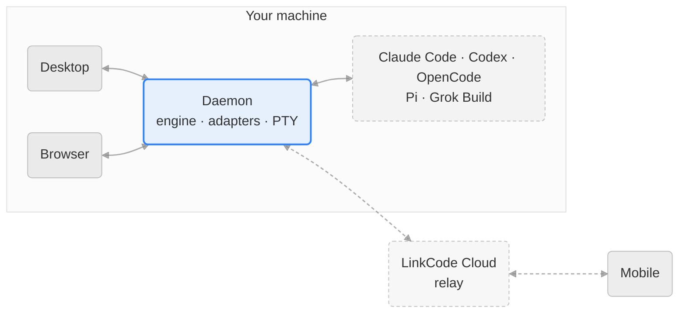

<h4 align="right"><strong>English</strong> | <a href="docs/README.zh-CN.md">简体中文</a></h4>

<p align="center">
    <picture>
      <source media="(prefers-color-scheme: dark)" srcset="https://static.linkcode.ai/icon/mark-white.png">
      
    </picture>
</p>

<h1 align="center">LinkCode</h1>
<p align="center"><strong>Every Code Agent in the Palm of Your Hand</strong></p>

<div align="center">
    <a href="https://github.com/arcboxlabs/linkcode/releases/latest" target="_blank">
    </a>
    <a href="https://github.com/arcboxlabs/linkcode/releases" target="_blank">
    </a>
    <a href="https://github.com/arcboxlabs/linkcode/commits" target="_blank">
    </a>
    <a href="LICENSE" target="_blank">
    </a>
    <a href="https://x.com/linkcodeai" target="_blank">
    </a>
</div>

<p align="center">
    <a href="#install">Install</a> ·
    <a href="#features">Features</a> ·
    <a href="#supported-agents">Supported Agents</a> ·
    <a href="#how-it-works">How It Works</a>
</p>

<picture>
  <source media="(prefers-color-scheme: dark)" srcset="https://static.linkcode.ai/screenshot/2026-07-desktop-new-task/shots-dark-rounded.webp?v=dee6283">
  
</picture>

LinkCode is one workspace for all your coding agents. A host on your machine takes over Claude Code, Codex, OpenCode, Pi, and Grok Build, normalizes their divergent events into a single contract, and serves the same threads to every client — start an agent at your desk, keep an eye on it from anywhere.

## Features

- **All your agents, one inbox** — run threads across five agents side by side, with the same UI and the same controls for every one of them.
- **Fully interactive** — permission approvals, plan review, questions, images, slash commands: everything an agent asks for, rendered natively instead of scrolling by in a terminal.
- **Real terminals** — PTY terminals backed by a native Rust sidecar, with multi-client attach and flow control that survives output floods.
- **Workspace at hand** — file tree, git panel, and project scripts with dev-server preview, right next to the conversation.
- **Automations** — schedule agent runs, or loop a prompt until the work is done.
- **Your history, kept in place** — sessions stay in each agent's own local history; LinkCode lists, imports, and resumes them without copying a transcript.
- **Local-first** — the host binds to loopback and your code never leaves the machine.
- **Remote & mobile control** *(not ready)* — an explicit tunnel through LinkCode Cloud will let you reach your host from anywhere and drive it from the companion mobile app; both are still in development.

## Supported Agents

| Agent | Vendor |
| --- | --- |
| [Claude Code](https://github.com/anthropics/claude-code) | Anthropic |
| [Codex](https://github.com/openai/codex) | OpenAI |
| [OpenCode](https://opencode.ai) | SST |
| [Pi](https://github.com/earendil-works/pi) | Earendil Works |
| [Grok Build](https://x.ai) | xAI |

> [!NOTE]
> Agent CLIs are not bundled with the app. The daemon picks up an existing install on your machine, or downloads a managed copy on demand — you sign in with your own agent accounts.

## How It Works



A local daemon hosts the engine and one adapter per agent. Adapters normalize each agent's native events into a single zod-validated data contract, carried over a versioned wire protocol; clients are thin renderers of that one normalized conversation, so desktop, browser, and mobile stay identical whether they connect directly or through the Cloud tunnel. The full picture — layers, contracts, and the data-plane/system-plane split — is in [`docs/ARCHITECTURE.md`](docs/ARCHITECTURE.md).

## Install

<a href="https://linkcode.ai/download"></a>

The button grabs the latest build for your platform. Prefer a package manager or a specific artifact:

### macOS

```bash
brew install --cask arcboxlabs/tap/linkcode
```

Or grab the DMG (Apple silicon / Intel) from the [latest release](https://github.com/arcboxlabs/linkcode/releases/latest).

### Windows & Linux

Download the installer (`.exe`), `.AppImage`, or `.deb` from the [latest release](https://github.com/arcboxlabs/linkcode/releases/latest).

The desktop app keeps itself up to date automatically.

## License

LinkCode is source-available under the [Business Source License 1.1](LICENSE); its logos and brand assets are licensed separately (see [`assets/LICENSE`](assets/LICENSE) and the [Brand Usage Terms](assets/BRAND.md)). Forking? [`docs/FORKING.md`](docs/FORKING.md) covers the rebranding checklist and a safe redistribution path.
