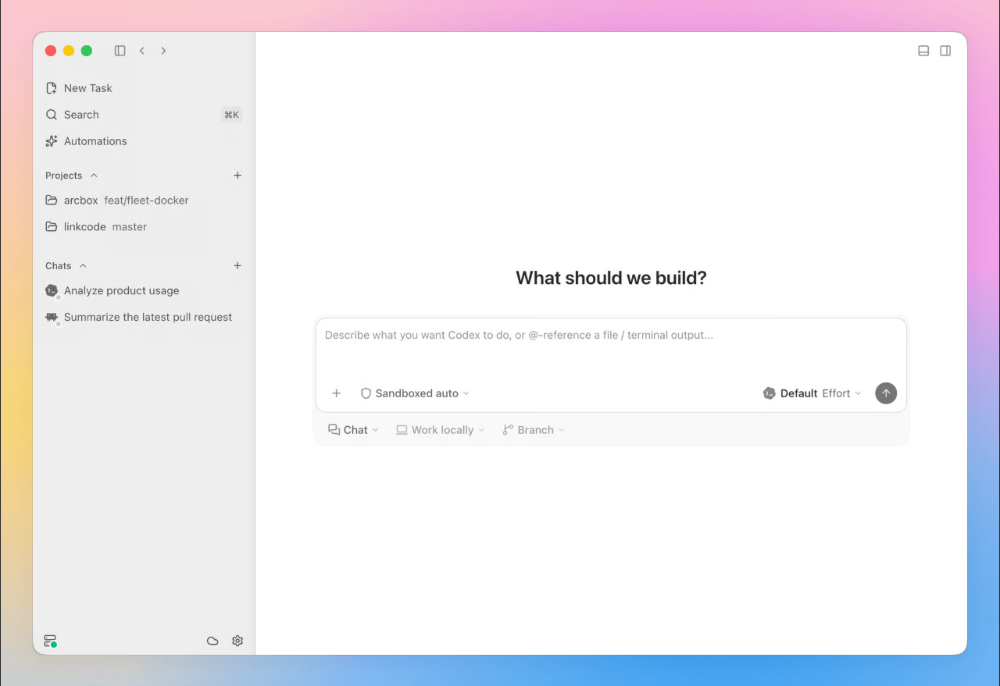
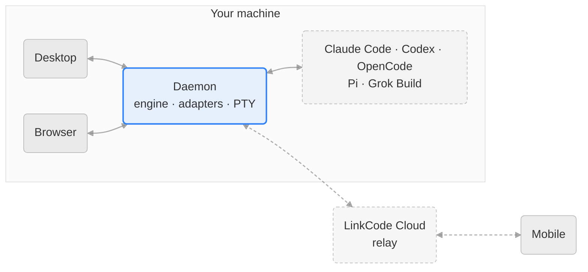

<h4 align="right"><strong>English</strong> | <a href="docs/README.zh-CN.md">简体中文</a></h4>

<p align="center">
    <picture>
      <source media="(prefers-color-scheme: dark)" srcset="https://static.linkcode.ai/icon/icon-dark.svg">
      
    </picture>
</p>

<h1 align="center">LinkCode</h1>
<p align="center"><strong>
Open-source alternative to Codex App / Workbuddy, supporting Codex, Claude Code, OpenCode, Pi, and Grok Build.
</strong></p>
<p align="center">
可能是最好用的 Codex App / WorkBuddy 开源平替，支持 Codex、Claude Code、OpenCode、Pi 和 Grok Build。
</p>

<div align="center">
    <a href="https://github.com/arcboxlabs/linkcode/releases/latest" target="_blank">
    </a>
    <a href="https://github.com/arcboxlabs/linkcode/releases" target="_blank">
    </a>
    <a href="https://github.com/arcboxlabs/linkcode/commits" target="_blank">
    </a>
    <a href="LICENSE" target="_blank">
    </a>
    <a href="https://x.com/linkcodeai" target="_blank">
    </a>
    <a href="https://arcbox.link/discord" target="_blank">
    </a>
</div>

<p align="center">
    <a href="#install">Install</a> ·
    <a href="#features">Features</a> ·
    <a href="#supported-agents">Supported Agents</a> ·
    <a href="#how-it-works">How It Works</a>
</p>

<picture>
  
</picture>

LinkCode is one workspace for all your coding agents. A host on your machine takes over Claude Code, Codex, OpenCode, Pi, and Grok Build, normalizes their divergent events into a single contract, and serves the same threads to every client — start an agent at your desk, keep an eye on it from anywhere.

## Features

- **All your agents, one inbox:** run threads across five agents side by side, with the same UI and the same controls for every one of them.
- **Fully interactive:** permission approvals, plan review, questions, images, slash commands: everything an agent asks for, rendered natively instead of scrolling by in a terminal.
- **Real terminals:** PTY terminals backed by a native Rust sidecar, with multi-client attach and flow control that survives output floods.
- **Workspace at hand:** file tree, git panel, and project scripts with dev-server preview, right next to the conversation.
- **Automations:** schedule agent runs, or loop a prompt until the work is done.
- **Your history, kept in place:** sessions stay in each agent's own local history; LinkCode lists, imports, and resumes them without copying a transcript.
- **Manage subscriptions and API keys:** Configure your existing subscriptions or third-party AI providers for agents directly, no additional tools required.
- **Local-first:** the host binds to loopback and your code never leaves the machine.
- **Remote & mobile control:** *(not ready)* an explicit tunnel through LinkCode Cloud will let you reach your host from anywhere and drive it from the companion mobile app; both are still in development.

## 功能特性

- **为所有 Agent 而生的统一交互界面：** 无论你爱用 Codex 还是 Claude Code，它们都有了同一套好用的界面和交互。
- **完整交互：** 权限审批、计划评审、提问、图片、slash 命令：Agent 想要的一切都以原生控件呈现，而无需使用终端交互。
- **自动嗅探：** 自动嗅探已安装的 Codex/Claude Code/Open Code CLI，自动导入已有对话记录。
- **真正的终端：** 由 Rust 驱动的高性能终端，支持多端接管，自带流控，为生产级环境准备。
- **完整工作区：** 文件树、git 面板、项目脚本与 dev server 预览，使用面板灵活编排。
- **自动化任务：** 定时运行 Agent，或者循环执行一个提示词直到工作完成。
- **导入已有会话：** 会话始终存放在各 Agent 自己的本地历史里；LinkCode 直接列出、导入、恢复它们，不复制任何转录。
- **管理订阅与 API Key：** 无需使用其他工具，直接为 Agent 配置已有订阅或者第三方 AI 服务商。
- **本地优先：** 你的代码你做主，直接在你自己的电脑上与 AI 交互。
- **远程与手机控制：** （即将发布）通过 LinkCode Cloud 显式开启隧道，即可在任何地方连回你的宿主，并用配套移动端 App 随行控制。
- **针对中国大陆网络优化：** （与移动端一同发布）无论你使用何种网络，都可以在 50ms 内远程遥控你的 Agent。

## Supported Agents

| Agent                                                    | Vendor         |
| -------------------------------------------------------- | -------------- |
| [Claude Code](https://github.com/anthropics/claude-code) | Anthropic      |
| [Codex](https://github.com/openai/codex)                 | OpenAI         |
| [OpenCode](https://opencode.ai)                          | SST            |
| [Pi](https://github.com/earendil-works/pi)               | Earendil Works |
| [Grok Build](https://x.ai)                               | xAI            |

> [!NOTE]
> Agent CLIs are not bundled with the app. The daemon picks up an existing install on your machine, or downloads a managed copy on demand — you sign in with your own agent accounts.

## How It Works


```mermaid
flowchart LR
    subgraph machine["Your machine"]
        DESKTOP("Desktop")
        WEB("Browser")
        DAEMON("Daemon<br/>engine · adapters · PTY")
        AGENTS("Claude Code · Codex · OpenCode<br/>Pi · Grok Build")
    end
    CLOUD("LinkCode Cloud<br/>relay")
    MOBILE("Mobile")

    DESKTOP <--> DAEMON
    WEB <--> DAEMON
    DAEMON <--> AGENTS
    DAEMON <--> CLOUD
    CLOUD <--> MOBILE

    classDef client fill:#88888826,stroke:#88888880
    classDef host fill:#2F81F71A,stroke:#2F81F7,stroke-width:2px
    classDef muted fill:#88888812,stroke:#88888880,stroke-dasharray:4 3
    class DESKTOP,WEB,MOBILE client
    class DAEMON host
    class AGENTS,CLOUD muted
    style machine fill:#88888809,stroke:#88888840
    linkStyle default stroke:#888888B0,stroke-width:1.5px
    linkStyle 3,4 stroke:#888888B0,stroke-width:1.5px,stroke-dasharray:4 3
```

A local daemon hosts the engine and one adapter per agent. Adapters normalize each agent's native events into a single zod-validated data contract, carried over a versioned wire protocol; clients are thin renderers of that one normalized conversation, so desktop, browser, and mobile stay identical whether they connect directly or through the Cloud tunnel. The full picture — layers, contracts, and the data-plane/system-plane split — is in [`docs/ARCHITECTURE.md`](docs/ARCHITECTURE.md).

## Install

<a href="https://linkcode.ai/download"></a>

The button grabs the latest build for your platform. Prefer a package manager or a specific artifact:

### macOS

```bash
brew install --cask arcboxlabs/tap/linkcode
```

Or grab the DMG (Apple silicon / Intel) from the [latest release](https://github.com/arcboxlabs/linkcode/releases/latest).

### Windows

```powershell
winget install -e --id ArcBox.LinkCode
```

Or grab the installer (`.exe`, x64 / arm64) from the [latest release](https://github.com/arcboxlabs/linkcode/releases/latest).

### Linux

Download the `.AppImage` or `.deb` from the [latest release](https://github.com/arcboxlabs/linkcode/releases/latest).

The desktop app keeps itself up to date automatically.

## License

LinkCode is source-available under the [Business Source License 1.1](LICENSE); its logos and brand assets are licensed separately (see [`assets/LICENSE`](assets/LICENSE) and the [Brand Usage Terms](assets/BRAND.md)). Forking? [`docs/FORKING.md`](docs/FORKING.md) covers the rebranding checklist and a safe redistribution path.
