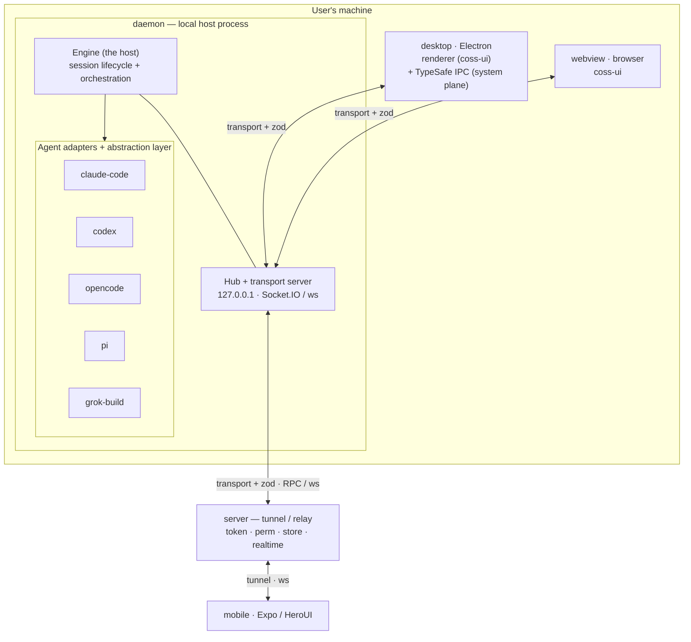

# LinkCode Architecture

LinkCode is a unified GUI for general-purpose coding agents. This document is the
source of truth for how the system is put together: its layers, its single data
contract, the split between the data plane and the system plane, the package
layout, the key runtime contracts, and the questions still open.

## Contents

- [Overview](#overview)
- [Core principles](#core-principles)
- [System architecture](#system-architecture)
- [Data plane vs system plane](#data-plane-vs-system-plane)
- [Packages & repo layout](#packages--repo-layout)
- [The host: engine, adapters, abstraction](#the-host-engine-adapters-abstraction)
- [Transport & wire protocol](#transport--wire-protocol)
- [Key contracts](#key-contracts)
- [Data flows](#data-flows)
- [Technology stack](#technology-stack)
- [Open questions](#open-questions)
- [Glossary](#glossary)

## Overview

LinkCode runs a local **host** on the user's machine that takes over any number of
coding agents — Claude Code, Codex, OpenCode, Pi, and Grok Build — and normalizes their
divergent native events into one shared data contract. A user connects to that
single host from **desktop (PC)**, **webview (browser)**, or **mobile**, and gets
the same conversation and the same controls everywhere. Desktop and webview connect
to the host directly on the local machine; mobile reaches it from outside the
network through a relay **Server** that tunnels the same messages.

Because every client speaks the same contract over the same transport abstraction,
the upper layers never know — or care — whether the host is a direct in-process
connection, a fan-out to several local clients, or a tunnel from a phone across the
internet.

## Core principles

1. **The zod schema is the only data contract.** Every cross-process, cross-endpoint,
   and post-abstraction business message type originates in `@linkcode/schema`. The
   workflow is always "change the schema first, then the implementation," and every
   trust boundary — network, IPC, agent output — validates with zod at runtime.
2. **End-to-end type safety.** No `any` to bypass the contract; types derive from the
   schema via `z.infer`. Other packages import from `@linkcode/schema` rather than
   redefining message types.
3. **The data plane and the system plane are strictly separate.** Business data travels
   only over the transport as zod messages. Electron's system- and UI-level operations
   travel only over TypeSafe IPC. The two never mix — **TypeSafe IPC never carries
   business data.**
4. **Local-first.** The host runs on the user's machine. Desktop and webview connect to
   it directly; mobile reaches it through the Server tunnel. Local and remote share the
   same transport abstraction and the same zod messages.
5. **Interface-first, implementations swappable.** TypeSafe IPC is an interface (tRPC is
   only the default implementation). Each new agent is one adapter implementing the
   unified interface — no per-vendor branching leaks into the upper layers.
6. **Transport is decoupled from its carrier.** An in-process local connection, a
   fan-out hub serving many local clients, and a WebSocket tunnel through the Server all
   present the same `Transport` and carry the same wire messages. Upper layers cannot
   tell which is underneath.

## System architecture



The `daemon` is the runnable local host: it constructs the `Engine`, hosts the agent
adapters, and exposes a transport server on `127.0.0.1` that every local client
connects to. The `Engine` is the host proper — it owns session lifecycle and agent
orchestration. Clients are thin: they render the normalized conversation and send
normalized input back.

Listeners bind at the configured port (default `19523`, ascii `LC`) and hunt upward
past foreign occupants. Every listener answers `GET /linkcode` with the daemon's
identity, which enforces one daemon per machine: a second instance detects the first
and exits. The actually-bound endpoints are advertised in `~/.linkcode/runtime.json`
(removed on shutdown) so local clients — desktop main in particular — can discover
the endpoint instead of hard-coding it.

## Data plane vs system plane

Two channels run side by side and never overlap:

- **Data plane** — all business data (sessions, agent events, tool calls, permission
  prompts, history). It flows over the `transport` as zod-validated wire messages, and
  is identical on every client and every carrier.
- **System plane** — desktop-only operating-system and window/UI operations (window
  controls, native dialogs, file pickers). It flows over **TypeSafe IPC** between the
  Electron main and renderer processes, and exists only on desktop.

Keeping them apart is what lets webview and mobile drop the system plane entirely while
reusing the exact same data-plane code, and it is why TypeSafe IPC must never be used to
move business data — doing so would couple business logic to Electron.

## Packages & repo layout

A pnpm-workspaces + turborepo monorepo, all TypeScript. `apps/*` are runnable ends;
`packages/*/*` are shared libraries grouped by architectural ownership. The whole system is glued by one zod contract
(`@linkcode/schema`) carried over a `transport`.

### Apps (`apps/`)

| App       | Description                                                                                                                                     |
| --------- | --------------------------------------------------------------------------------------------------------------------------------------------- |
| `daemon`  | Local host process — constructs the engine and exposes the data plane over a local Socket.IO/WebSocket server (`127.0.0.1`) that every client connects to. |
| `desktop` | Electron app: Vite renderer + main/preload. The renderer connects to `daemon` over `transport`; the system plane goes through TypeSafe IPC.    |
| `webview` | Browser client — Vite + React Router + coss-ui. Connects to `daemon` over `transport`. No system plane.                                        |
| `mobile`  | Expo / React Native client (HeroUI). Reaches the host through the `server` tunnel.                                                             |
| `server`  | Tunnel / relay: `token`, `perm`, `store`, `realtime`. Does not run agents. Host ↔ Server is RPC over WebSocket.                                |

### Packages (`packages/`)

Scopes make ownership and navigation visible; they do not rename package imports and do not by
themselves enforce dependencies. Package contracts, ESLint, and the root typecheck remain the
dependency guardrails.

| Scope | Packages | Responsibility |
| --- | --- | --- |
| `foundation` | `schema`, `transport`, `common` | Stable contracts, communication primitives, and framework-agnostic utilities. |
| `host` | `agent-adapter`, `assets`, `engine` | Daemon-side agent integration, managed assets, and orchestration. |
| `client` | `client-core`, `sdk`, `workbench` | Client data plane, typed operations, runtime containers, and feature composition. |
| `presentation` | `i18n`, `ui` | Locale data and business-free presentation driven by view-models and callbacks. |
| `system-plane` | `ipc` | Desktop-only Electron system-plane communication. |
| `integrations` | `im-render` | Reusable adapters at external integration boundaries. |
| `vendor` | `coss-ui` | Upstream code preserved and consumed as-is. |

| Package path | Description |
| --- | --- |
| `foundation/schema` | zod schemas — the single data contract. Every cross-process / cross-end / post-abstraction message type derives from here (`z.infer`). |
| `foundation/transport` | Communication layer ("how messages travel"): local / ws / Socket.IO implementations, the `Hub` fan-out, and the versioned wire protocol. |
| `foundation/common` | Shared framework-agnostic utilities that do not belong to the data contract or a product layer (for example Zustand persistence helpers). |
| `host/agent-adapter` | One adapter per agent (`claude-code` / `codex` / `opencode` / `pi` / `grok-build`) plus the abstraction layer that normalizes native events into `schema`. |
| `host/assets` | Managed-asset store for verified agent CLI pairs, in-process package closures, and standalone toolchains. |
| `host/engine` | The host engine: session lifecycle and agent orchestration, driving `agent-adapter`. |
| `client/client-core` | Shared client data layer: `LinkCodeClient`, the conversation view-model, and React bindings (`LinkCodeProvider`, `useConversation`). |
| `client/sdk` | Transport-backed SDK (`LinkCodeSdkClient` over a `Transport`): typed operations plus the `Options` / `RequestResult` types `tayori` is parameterized with. Hand-written RPC, not OpenAPI-generated. |
| `client/workbench` | Shared workbench runtime: connection control, providers, feature containers, and typed `tayori`/SWR data plumbing. It composes presentation but does not own reusable views. |
| `presentation/i18n` | Locale messages and locale resolution (`use-intl`). |
| `presentation/ui` | Shared, business-free presentation: chat and shell view components (`AppShell`). Receives view-models and callbacks; owns no routing, connection, or daemon state. |
| `system-plane/ipc` | TypeSafe IPC (system plane) for Electron; `tRPC` is the default implementation. Desktop only. |
| `integrations/im-render` | LinkCode-owned, platform-neutral `AgentEvent` / conversation-to-Markdown renderer. Telegram, Discord, and Slack escaping, splitting, buttons, and delivery remain in the external `linkcodehq` bridges. |
| `vendor/coss-ui` | Vendored COSS UI primitives (base-ui + Tailwind, from cal.com's COSS UI). Synced from upstream and excluded from formatting and linting. |

## The host: engine, adapters, abstraction

The host is the `Engine` plus the adapter and abstraction layers beneath it.

**Engine.** Manages many concurrent agent sessions. For each session it subscribes to
the adapter's normalized events and pushes them down to clients over the transport,
while routing inbound input back up to the matching adapter. The Engine is agnostic to
the carrier: a direct local connection, a fan-out `Hub`, or a Server tunnel all drive
the same Engine.

Sessions are persisted as `SessionRecord`s through an injectable `SessionStore` (the
daemon backs it with SQLite via drizzle at `~/.linkcode/daemon.db`). A record is the
stable Link Code identity: each start/resume appends a *run* that the adapter's
`session-ref` event binds to the provider-local history id. `session.list` includes
cold (stopped) sessions, `session.resume` wakes one under the same id, and
`session.import` registers a provider-local history session as a cold record.
Transcripts are not copied — they stay in provider-local history and are read back
through the history contract.

**Agent adapters.** One adapter per agent — `claude-code`, `codex`, `opencode`, `pi`, `grok-build` —
each hiding its SDK's differences behind the unified `AgentAdapter` interface. A shared
`BaseAgentAdapter` factors out the common machinery (event fan-out, pending permission
asks). Adapters advertise their `historyCapabilities` (list / read / resume), and any
unsupported operation rejects clearly rather than silently degrading.

**Abstraction layer.** Adapters normalize each agent's native events into the zod
`AgentEvent` contract, and accept the
normalized `AgentInput`. The agent data vocabulary — content, tool calls, plans,
permissions, sessions, usage, history — is tailored to the five supported agents and
the front-end, not to any particular wire format.

## Transport & wire protocol

The `transport` package answers "how messages travel." It offers one `Transport`
interface with several implementations — an in-process local transport, a WebSocket
transport, and a Socket.IO transport — plus a `TransportServer` that accepts client
connections and presents each as a `Transport`. A client `Transport` instance owns one
physical connection lifetime and never silently revives after close; recovery creates a
fresh transport and client generation. Carrier connection alone is not application
readiness: `LinkCodeClient.connect()` resolves only after a versioned `ping` / `pong`
round trip, so a wire-incompatible peer cannot become falsely ready.

The daemon serves many clients at once through a **`Hub`**, which composes every client
connection into the single `Transport` the host consumes. Inbound messages from every
client are merged into one host stream, while the Hub retains the originating connection
for each correlation id (`clientReqId` → `replyTo`) and returns the reply only there.
`agent.event` keeps its broadcast/attached-session behavior; live `terminal.*` frames go
only to connections attached to that terminal. Removing a physical or relay-virtual
connection detaches all of its terminal capabilities before the connection disappears.

The Cloud tunnel adds a relay-attested peer envelope outside `WireMessage`. The daemon's one
host uplink exposes each remote peer as a separate virtual `Transport`, so Hub reply and
terminal routing has the same connection boundary locally and remotely. Host frames are
directed to one peer; the relay never broadcasts one client's opaque wire replies to the
other clients of that host.

Every message is a **versioned envelope** (version, id, timestamp) wrapping a payload.
The payload is a discriminated union keyed by `kind` (`session.start` / `session.started`,
`session.list` / `session.listed`, `history.list` / `history.listed`, `agent.event`, and
so on). Local direct connections and remote tunnels share the identical format, and every
receiving end validates with zod at its trust boundary before delivery. Senders do not
re-validate (the per-frame send parse was hot on the terminal wire, CODE-231): `send()` takes
the branded `ValidatedWireMessage`, minted only by `createWireMessage` (typed construction)
and `parseWireMessage` (boundary validation), so an unchecked object cannot reach a send path
without an explicit cast. `LocalTransport` alone keeps a send-side parse so tests and the
dev-mock host catch schema drift behind the brand.
Any change to the payload union bumps `WIRE_PROTOCOL_VERSION`; the version is a validated
literal, so a stale peer rejects every message — after a bump, restart the daemon and all
clients together.

Interactive permission and question requests have a host-authoritative lifecycle. The Engine
records each advertised request as open, validates responses against that exact request, emits a
responding status while the adapter call is in flight, and emits one terminal resolved outcome.
Adapter rejection restores the request; tool completion, turn end, stop, and delete cancel any
remaining request explicitly. `session.attach` replays open/responding requests and terminal
outcomes from the current or most recently completed turn so reconnecting clients converge; the
next turn drops those resolved tombstones. Clients render pending requests in arrival-order FIFO,
keep drafts local, and submit a multi-question request as one ordered response.

## Key contracts

All of the types below derive from `@linkcode/schema`; the signatures are the current
shape in `packages/*/*`, elided for readability.

```ts
// @linkcode/agent-adapter — one adapter per agent; native events → normalized AgentEvent
interface AgentAdapter {
  readonly kind: AgentKind;                                  // 'claude-code' | 'codex' | 'opencode' | 'pi' | 'grok-build'
  readonly capabilities: AgentCapabilities;                  // { slashCommands, shellCommand }
  readonly historyCapabilities: AgentHistoryCapabilities;    // { list, read, resume }
  start(opts: StartOptions): Promise<void>;
  send(input: AgentInput): Promise<void>;
  onEvent(cb: (e: AgentEvent) => void): Unsubscribe;         // normalized by the abstraction layer
  stop(): Promise<void>;
  // provider-local history, when advertised:
  listHistory(opts?: AgentHistoryListOptions): Promise<AgentHistoryListResult>;
  readHistory(opts: AgentHistoryReadOptions): Promise<AgentHistoryReadResult>;
  resumeHistory(opts: AgentHistoryResumeOptions, startOpts: StartOptions): Promise<void>;
}

// @linkcode/transport — the carrier-agnostic message pipe + its listener
interface Transport {
  connect(): Promise<void>;
  send(msg: ValidatedWireMessage): void | Promise<void>;     // brand minted by createWireMessage / parseWireMessage
  onMessage(cb: (msg: ValidatedWireMessage) => void): Unsubscribe; // zod-validated on receive
  onClose(cb: () => void): Unsubscribe;
  close(): void | Promise<void>;
}
interface TransportServer {
  onConnection(cb: (conn: Transport) => void): Unsubscribe;
  close(): Promise<void>;
}

// @linkcode/sdk — transport-backed client the front-end data layer is built on
class LinkCodeSdkClient {
  constructor(options: { transport: Transport });
  connect(): Promise<void>;                                // resolves after LinkCode ping/pong
  onClose(cb: (error: Error) => void): Unsubscribe;         // unexpected close after readiness
  dispose(): void;
  listSessions(): RequestResult<SessionInfo[]>;
  startSession(opts: StartOptions): RequestResult<SessionId>;
  stopSession(id: SessionId): RequestResult<{ ok: true }>;
  resumeSession(id: SessionId): RequestResult<SessionId>;   // cold session → live again, same id
  importSession(kind: AgentKind, historyId: AgentHistoryId): RequestResult<SessionRecord>;
  sendInput(id: SessionId, input: AgentInput): RequestResult<{ ok: true }>;
  promptText(id: SessionId, text: string): RequestResult<{ ok: true }>;
  cancel(id: SessionId): RequestResult<{ ok: true }>;
  respondPermission(id: SessionId, requestId: string, outcome: PermissionOutcome): RequestResult<{ ok: true }>;
  // history: listHistory / readHistory / resumeHistory
}
```

The desktop system plane is a separate interface entirely, carrying only OS/UI
capabilities and never business data:

```ts
// @linkcode/ipc — system plane, desktop only (tRPC is the default implementation)
interface SystemBridge {
  window: { minimize(): void; maximize(): void; close(): void };
  fs: { pickFile(): Promise<string | null> };
  // system / UI capabilities only — business data always goes over transport
}
```

## Data flows

1. **Local direct** — desktop or webview ↔ daemon, over the transport with zod messages
   on the local machine.
2. **Multi-client routing** — several clients attach to the daemon's `Hub`; agent events
   broadcast according to the session subscription, correlated replies return to their
   origin, and terminal streams reach only attached connections.
3. **Host uplink** — daemon ↔ Server, RPC over WebSocket. A relay-attested outer peer
   envelope multiplexes virtual client connections while its payload remains the same
   normalized zod message.
4. **Remote access** — mobile ↔ Server tunnel ↔ daemon, over WebSocket. The phone renders
   and controls the same host as any local client.

## Technology stack

| Concern                | Choice                                                                       |
| ---------------------- | ---------------------------------------------------------------------------- |
| Language               | TypeScript (`strict`) across the stack                                       |
| Data contract          | zod                                                                          |
| Monorepo               | pnpm workspaces + turborepo                                                  |
| Wire protocol          | Custom versioned transport envelope over Socket.IO / ws; in-process locally  |
| Desktop shell          | Electron (Vite renderer)                                                      |
| Desktop system bridge  | TypeSafe IPC (tRPC default implementation)                                    |
| Desktop / webview UI    | coss-ui (base-ui + Tailwind)                                                  |
| Mobile                 | Expo / React Native (HeroUI)                                                  |
| Client data layer      | `sdk` + `tayori` + SWR                                                        |
| Agents                 | Claude Code · Codex · OpenCode · Pi                                           |
| Lint / format          | ESLint (`eslint-config-sukka`) / Biome (formatting only)                     |

## Open questions

These are genuinely undecided. Do not invent answers — raise them first.

- **Server internals.** The data models and protocols behind the Server's `token`,
  `perm`, `store`, and `realtime` capabilities.
- **Multi-agent product behavior.** Whether multiple agents run concurrently or are
  switched between, and how that is surfaced in the UI.
- **Alternative system-plane implementations.** Candidates for TypeSafe IPC beyond the
  default tRPC.
- **The `pi` agent integration.** The exact SDK and integration shape for Pi.

## Glossary

| Term              | Meaning                                                                                  |
| ----------------- | ---------------------------------------------------------------------------------------- |
| Host              | The core engine on the user's machine that takes over every agent.                       |
| Engine            | The host implementation: session lifecycle + agent orchestration (`@linkcode/engine`).   |
| daemon            | The runnable local process that hosts the Engine and serves clients on `127.0.0.1`.      |
| Agent adapter     | Per-agent integration that hides an SDK behind the unified `AgentAdapter` interface.     |
| Abstraction layer | Normalizes native agent events into the zod contract.                                    |
| Hub               | Fan-out that composes many client connections into one `Transport` and broadcasts events. |
| transport         | The carrier-agnostic message layer (local / ws / Socket.IO).                              |
| Wire protocol     | The versioned envelope + `kind`-keyed payload union transmitted over the transport.       |
| zod schema        | The single data contract; the one source of every message type.                          |
| TypeSafe IPC      | Type-safe Electron IPC for the system plane; desktop only; never carries business data.  |
| tRPC              | The default TypeSafe IPC implementation; swappable.                                       |
| tayori            | The typed request wrapper the client data layer is built on, backed by the `sdk`.        |
| coss-ui           | The desktop/webview UI primitive library (vendored from cal.com's COSS UI).              |
| HeroUI            | The mobile UI library.                                                                    |
| Thread (UI)       | The user-facing term for a Session. Product copy only — code and the wire protocol keep `Session`. |
| ACP               | Agent Client Protocol — an early influence on `AgentEvent`, since dropped for a shape tailored to the five supported agents. |
