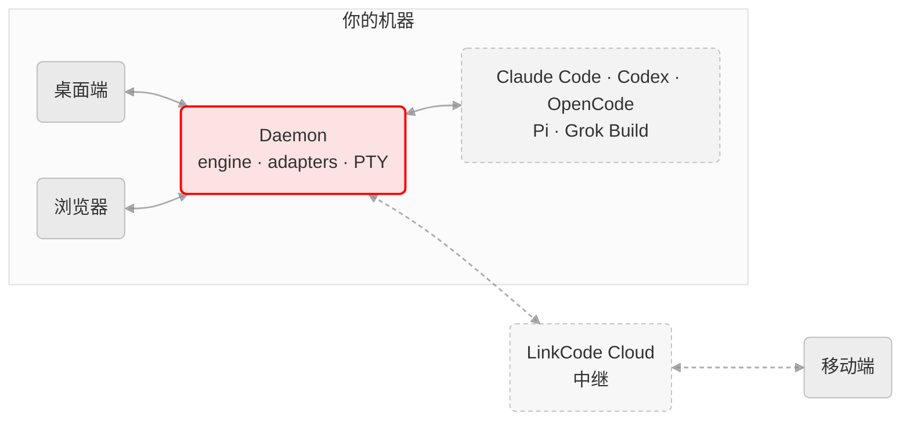

<h4 align="right"><a href="../README.md">English</a> | <strong>简体中文</strong></h4>

<p align="center">
    
</p>

<h1 align="center">LinkCode</h1>
<p align="center"><strong>每一个 Code Agent,尽在掌心</strong></p>

<div align="center">
    <a href="https://github.com/arcboxlabs/linkcode/releases/latest" target="_blank">
    </a>
    <a href="https://github.com/arcboxlabs/linkcode/releases" target="_blank">
    </a>
    <a href="https://github.com/arcboxlabs/linkcode/commits" target="_blank">
    </a>
    <a href="../LICENSE" target="_blank">
    </a>
    <a href="https://twitter.com/arcboxlabs" target="_blank">
    </a>
</div>

<p align="center">
    <a href="#安装">安装</a> ·
    <a href="#功能特性">功能特性</a> ·
    <a href="#支持的-agent">支持的 Agent</a> ·
    <a href="#工作原理">工作原理</a>
</p>

<picture>
  <source media="(prefers-color-scheme: dark)" srcset="https://static.linkcode.ai/screenshot/2026-07-desktop-new-task/shots-dark-rounded.webp?v=dee6283">
  
</picture>

LinkCode 是所有 Coding Agent 的统一工作台。它在你的机器上运行一个本地宿主,接管 Claude Code、Codex、OpenCode、Pi 和 Grok Build,把它们各不相同的原生事件归一成同一份数据契约,再把同样的会话投送到每一个客户端 —— 在电脑前启动 Agent,走到哪里都能随时照看。

## 功能特性

- **所有 Agent,一个收件箱** —— 五种 Agent 的会话并排运行,共用同一套界面和同一套操作。
- **完整交互** —— 权限审批、计划评审、提问、图片、slash 命令:Agent 想要的一切都以原生控件呈现,而不是在终端里刷屏滚过。
- **真正的终端** —— 由原生 Rust sidecar 驱动的 PTY 终端,支持多端接管,自带流控,洪流输出也不会卡死。
- **工作区随手可及** —— 文件树、git 面板、项目脚本与 dev server 预览,就在会话旁边。
- **自动化** —— 定时运行 Agent,或者循环执行一个提示词直到工作完成。
- **历史留在原地** —— 会话始终存放在各 Agent 自己的本地历史里;LinkCode 直接列出、导入、恢复它们,不复制任何转录。
- **本地优先** —— 宿主只绑定本机回环地址,代码不出机器;远程访问是通过 LinkCode Cloud 显式开启的隧道(配套移动端 App 正在开发中)。

## 支持的 Agent

| Agent | 厂商 |
| --- | --- |
| [Claude Code](https://github.com/anthropics/claude-code) | Anthropic |
| [Codex](https://github.com/openai/codex) | OpenAI |
| [OpenCode](https://opencode.ai) | SST |
| [Pi](https://github.com/earendil-works/pi) | Earendil Works |
| [Grok Build](https://x.ai) | xAI |

> [!NOTE]
> 应用不内置 Agent CLI。daemon 会自动探测机器上已有的安装,或按需下载一份托管副本 —— 你用自己的 Agent 账号登录。

## 工作原理



本地 daemon 承载引擎,并为每个 Agent 配一个 adapter。adapter 把各家的原生事件归一成一份 zod 校验的数据契约,经带版本号的 wire 协议传输;客户端只是这份归一化会话的轻量渲染器,因此桌面端、浏览器和移动端无论直连还是走 Cloud 隧道,看到的都完全一致。完整设计 —— 分层、契约、数据面与系统面的切分 —— 见 [`docs/ARCHITECTURE.md`](./ARCHITECTURE.md)。

## 安装

### macOS

```bash
brew install --cask arcboxlabs/tap/linkcode
```

也可以从 [最新 Release](https://github.com/arcboxlabs/linkcode/releases/latest) 下载 DMG(Apple silicon / Intel)。

### Windows 与 Linux

从 [最新 Release](https://github.com/arcboxlabs/linkcode/releases/latest) 下载安装包(`.exe`)、`.AppImage` 或 `.deb`。

桌面端会自动保持更新。

## 许可证

LinkCode 以 [Business Source License 1.1](../LICENSE) 的 source-available 形式提供;Logo 与品牌资产单独授权(见 [`assets/LICENSE`](../assets/LICENSE) 与 [品牌使用条款](../assets/BRAND.md))。想 fork?去品牌清单与安全的再分发路径见 [`docs/FORKING.md`](./FORKING.md)。
